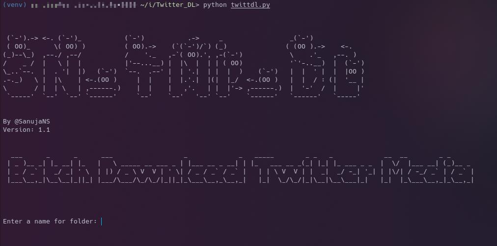

# SN_Twi_DL



This is my way to easily batch download Twitter media.

### > ***No account or API key required. Uses a private API for data scraping.***

**This code downloads Twitter Media in highest resolution available.**

## Requirements

> * requests
> * PySocks

---

## Instructions

### 1. Get Code
```bash
git clone https://github.com/SanujaNS/Twitter_DL.git
cd Twitter_DL
```

### 2. Install requirements
```python
python -m venv venv

source venv/bin/activate

pip install --upgrade pip

pip install -r requirements.txt
```

### 3. Add proxies to proxy.txt
Add proxies as
```
ip:port
ip:port
```

You can find free proxy lists just with a google search.

### 4. Media URLs
Add Twitter urls to img.txt if you want to get images,
If you want to get videos then add urls to vid.txt

### 5. Run Code
```python
python twittdl.py
```

Now you will be prompted with "Enter a name for folder: " ,
Type your choice of name for a folder. Then press 'Enter'.
Now all the media will be downloaded to the folder with the name of your choice.

### That's it. Enjoy...
### If you like this project don't forget to give it a Star. 😁

# Donation

|**[Buy me a coffee ☕](https://bmc.link/sanujans)**|
|---------------------------------------------------|
|                       |
|                                                   |

# License

Apache License 2.0
